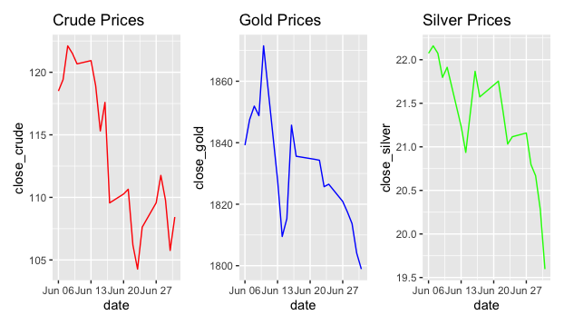
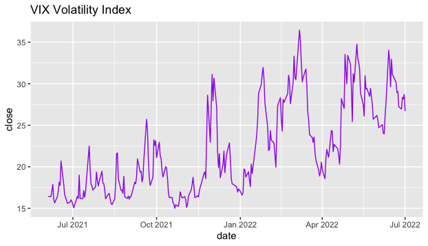
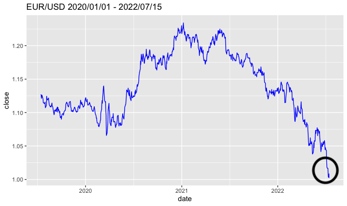
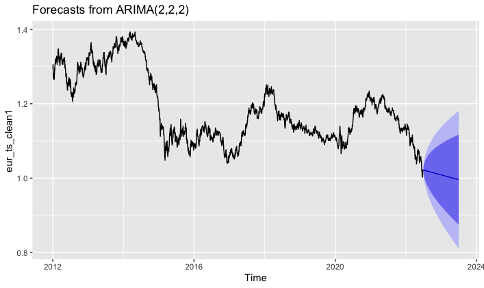
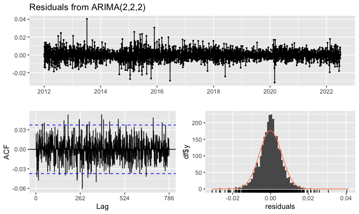
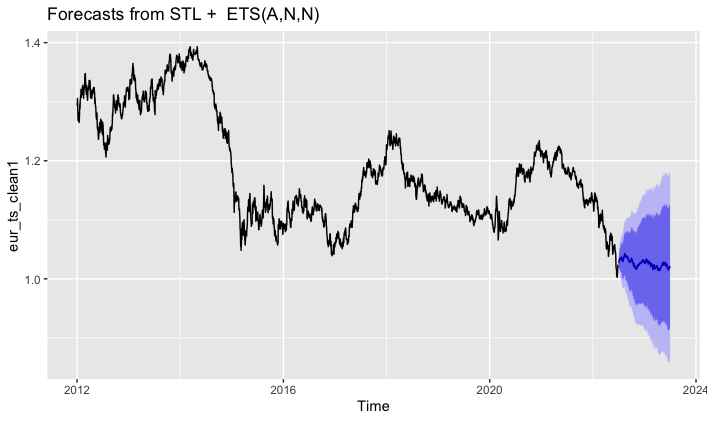
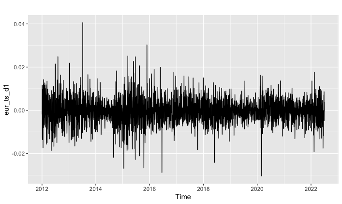
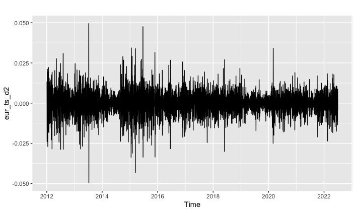

# My Portfolio

Welcome to my GitHub Page. 

My name is Luis Felipe Bolaños Serrano. I'm an economist graduated from the University of Costa Rica in 2020 and I'm currently doing my MSc at Nova School of Business and Economics (Universidade Nova de Lisboa) in Lisbon, Portugal. 

Here you will find my Portfolio. It includes the major Data Science projects that I've created using R Studio and some other projects. These are mostly weekly insights that I publish in my Linkedin page or other research-related work, however, they all include coding and economic analysis. 

## Project 1: Analyzing Bitcoin (BTC) price while inflation expectations are high

i. Used tidyquant, tidyverse, timetk, lubridate, dplyr ggplot2 to extract, analyze and visualize how BTC has behaved during 2022 when it went below $20,000 

ii. Obtained other time series such as University of Michigan monthly Inflation Expectations from the FRED Website using Tidyquant in order to better understand BTC's downward spiral

iii. Analyzed the bond and foreign exchange market by extracting information in an automated way using the Tidyquant Package in R

Full PDF document here: [BTC](https://es.overleaf.com/read/bzsxgpyjqhkb)

## Project 2: Forecasting the Costa Rican Colon (CRC) Exchange Rate using the Prophet Package and Time Series filtering using mFilter

i. Used the Prophet package to forecast the CRC/USD exchange rate. Prophet proved to be a good package to forecast these kinds of series because of non-linearity and high seasonality

ii. With Prophet the seasonality of the variables was analyzed thoroughly. It was observed that the days with the highest seasonality are from Wednesday to Saturday whereas the months with the highest seasonality are June and November

iii. mFilter was used to separate the different components of the time series

Full PDF document here: [CRC](https://es.overleaf.com/read/rvjfyttvytzh)

## Project 3: Analyzing commodities when volatility is high and bond & equity returns are low using the tidyquant Package

i. Analyzed the what has happened with the price of commodities and how these real assets have been one of the best options to take refuge against inflation in 2022 

ii. Obtained the VIX index data using tidyquant in order to understand what has happened with volatility and why commodities are still a risky choice to invest nowadays. 

## Project 4: Understanding the EUR/USD 1:1 parity  

i. Using several R packages such as ggplot2, tidyverse, tidyquant, timetk, lubridate, magrittr and dplyr I studied why the EUR/USD parity happened during 2022

ii. Other time series were obtained (using tidyquant) such as the Fed Funds Rate, the University of Michigan inflation expectations and the Eurozone expected inflation

## Project 5: Forecasting the EUR/USD exchange rate using various methods
 
i. Used the forecast, tseries, timetk, dplyr, tidyverse and tidyquant packages in order to obtain, analyze, plot and model the time series. 

ii. Using the forecast package, it was possible to apply various models to forecast the time series. The models used were ARIMA and ETS. It was thoroughly analyzed using the Ljung-Box test, Augmented Dickey Fuller test and the function checkresiduals in order to search for autocorrelation. It was found that errors did not present autocorrelation and were in the 0 neighborhood. The specification of ARIMA(2,2,2) was chosen because the errors 

iii. With the tseries package, it was possible to observe and prove that the original time series was non-stationary, hence, it was differenced twice until the ADF test determined that the series was stationary. Below, the first-differenced and second differenced time series can be observed. 

 

Full PDF document here: [EUR_Forecast](https://es.overleaf.com/read/kjcbcchbfxkf)

